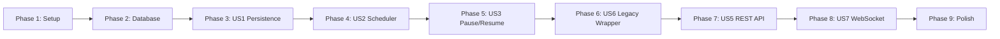

# Tasks: Job/Queue Manager

**Input**: Design documents from `/specs/007-queue-manager/`  
**Prerequisites**: plan.md ✅, spec.md ✅, data-model.md ✅, contracts/ ✅, quickstart.md ✅

**Tests**: Constitution Principle VI mandates test-first. Tests included per user story.

**Organization**: Tasks follow the user's specified linear sequence: DB → Queue Manager → Scheduler → Engine Integration → Legacy Wrapper → New API → WebSocket.

## Format: `[ID] [P?] [Story] Description`

- **[P]**: Can run in parallel (different files, no dependencies)
- **[Story]**: Which user story this task belongs to (e.g., US1, US2, US3)
- Include exact file paths in descriptions

---

## Phase 1: Setup (Shared Infrastructure)

**Purpose**: New dependency, config, and database foundation

- [x] T001 Add `aiosqlite` to `requirements.txt`
- [x] T002 Add `db_path` setting to `src/config.py` (default: `data/thunder.db`)
- [x] T003 Create `data/` directory in `.gitignore` to exclude SQLite database from version control

**Checkpoint**: Config ready, new dependency available

---

## Phase 2: Foundational — Database Layer (Blocking)

**Purpose**: SQLite schema, connection management, and migration logic. MUST complete before any user story.

**⚠️ CRITICAL**: No user story work can begin until this phase is complete

**Covers**: FR-001

- [x] T004 Create `src/db.py` — async SQLite connection manager with WAL mode, `get_db()` context manager, and `init_db()` schema creation
- [x] T005 Implement `jobs` table schema in `src/db.py` — CREATE TABLE with all 28 columns, CHECK constraints, and DEFAULT values per `data-model.md`
- [x] T006 Implement `groups` table schema in `src/db.py` — CREATE TABLE with FK relationship to jobs, CHECK constraint on status
- [x] T007 Implement `settings` table schema in `src/db.py` — CREATE TABLE with seed data (concurrency limits, download_dir)
- [x] T008 Implement 4 indexes in `src/db.py` — `idx_jobs_status_priority`, `idx_jobs_engine_status`, `idx_jobs_group_id`, `idx_jobs_created_at`
- [x] T009 Write tests for database initialization in `tests/test_db.py` — verify schema creation, WAL mode, seed data, and idempotent re-init

**Checkpoint**: Database schema exists and is tested. `init_db()` creates all tables/indexes on first run.

---

## Phase 3: User Story 1 — Persistent Download Queue (Priority: P1) 🎯 MVP

**Goal**: Jobs are persisted to SQLite and survive daemon restart. Hot Cache mirrors active jobs in memory.

**Independent Test**: Submit a download, kill daemon, restart, verify job is still listed.

**Covers**: FR-002, FR-005, FR-006, FR-007

### Tests for User Story 1

- [x] T010 [P] [US1] Write unit tests for `QueueManager.create_job()`, `get_job()`, `update_job()`, `list_jobs()` in `tests/test_queue_manager.py`
- [x] T011 [P] [US1] Write test for Hot Cache sync — verify progress updates stay in-memory only, state transitions write to SQLite in `tests/test_queue_manager.py`
- [x] T012 [P] [US1] Write test for startup recovery — pre-populate SQLite, init QueueManager, verify Hot Cache loads non-terminal jobs in `tests/test_queue_manager.py`

### Implementation for User Story 1

- [x] T013 [US1] Expand `DownloadStatus` enum in `src/models.py` — add `PAUSED = "paused"` and `CANCELLED = "cancelled"` values
- [x] T014 [US1] Create `src/queue_manager.py` — `QueueManager` class with `__init__`, `_hot_cache: dict`, `_lock: asyncio.Lock`, `_db_path: str`
- [x] T015 [US1] Implement `QueueManager.init()` in `src/queue_manager.py` — call `init_db()`, load non-terminal jobs from SQLite into Hot Cache
- [x] T016 [US1] Implement `QueueManager.create_job()` in `src/queue_manager.py` — INSERT into SQLite, add to Hot Cache, return `DownloadJob`
- [x] T017 [US1] Implement `QueueManager.get_job()` in `src/queue_manager.py` — read from Hot Cache first, fallback to SQLite for terminal jobs
- [x] T018 [US1] Implement `QueueManager.update_job()` in `src/queue_manager.py` — state transitions write to SQLite + update cache; progress-only updates write to cache only
- [x] T019 [US1] Implement `QueueManager.list_jobs()` in `src/queue_manager.py` — paginated query with status/engine/group_id filters, merge Hot Cache volatile fields (progress/speed/eta) into results
- [x] T020 [US1] Implement `QueueManager.delete_job()` in `src/queue_manager.py` — DELETE from SQLite, remove from Hot Cache if present

**Checkpoint**: QueueManager persists jobs, Hot Cache provides volatile data, startup recovery works. No scheduler yet — all jobs stay QUEUED.

---

## Phase 4: User Story 2 — Concurrency-Limited Scheduling (Priority: P1)

**Goal**: Event-driven scheduler promotes QUEUED jobs respecting global + per-engine limits.

**Independent Test**: Submit 15 ytdlp downloads, verify only 3 start. Complete one, verify 4th promoted.

**Covers**: FR-008, FR-009, FR-010, FR-011

**Depends on**: Phase 3 (US1)

### Tests for User Story 2

- [x] T021 [P] [US2] Write unit test for scheduler slot counting — verify global and per-engine limit enforcement in `tests/test_queue_manager.py`
- [x] T022 [P] [US2] Write test for event-driven wake — verify scheduler wakes on `asyncio.Event.set()` and promotes jobs in FIFO order in `tests/test_queue_manager.py`
- [x] T023 [P] [US2] Write test for dynamic limit updates — change settings, verify scheduler uses new limits on next evaluation in `tests/test_queue_manager.py`

### Implementation for User Story 2

- [x] T024 [US2] Implement `QueueManager._load_settings()` in `src/queue_manager.py` — read concurrency limits from `settings` table into instance vars
- [x] T025 [US2] Implement `QueueManager._count_active_slots()` in `src/queue_manager.py` — count DOWNLOADING jobs globally and per-engine from Hot Cache
- [x] T026 [US2] Implement `QueueManager._promote_next()` in `src/queue_manager.py` — query QUEUED jobs ordered by priority DESC, created_at ASC; promote up to available slots; call `_execute_download()` for each
- [x] T027 [US2] Implement `QueueManager._scheduler_loop()` in `src/queue_manager.py` — `async` task that loops on `asyncio.Event.wait()`, calls `_promote_next()`, clears event
- [x] T028 [US2] Implement `QueueManager._on_job_finished()` in `src/queue_manager.py` — called when any job reaches terminal/paused state; frees slot, fires `_scheduler_event.set()`
- [x] T029 [US2] Wire scheduler startup in `QueueManager.init()` — create `asyncio.create_task(_scheduler_loop())`, initial `_scheduler_event.set()` to evaluate queue on boot

**Checkpoint**: Scheduler enforces limits, event-driven with zero polling. Downloads are promoted in FIFO order.

---

## Phase 5: User Story 3 — Pause, Resume, and Cancel (Priority: P1)

**Goal**: Users can pause/resume/cancel individual jobs with correct state transitions and slot management.

**Independent Test**: Pause a downloading job, verify slot freed. Resume, verify re-queued. Cancel, verify terminal.

**Covers**: FR-012, FR-013, FR-014, FR-015, FR-016

**Depends on**: Phase 4 (US2)

### Tests for User Story 3

- [ ] T030 [P] [US3] Write test for pause — DOWNLOADING→PAUSED, task cancelled, slot freed in `tests/test_queue_manager.py`
- [ ] T031 [P] [US3] Write test for resume — PAUSED→QUEUED, scheduler woken in `tests/test_queue_manager.py`
- [ ] T032 [P] [US3] Write test for cancel — QUEUED→CANCELLED and DOWNLOADING→CANCELLED in `tests/test_queue_manager.py`
- [ ] T033 [P] [US3] Write test for retry — FAILED→QUEUED, retry_count incremented in `tests/test_queue_manager.py`
- [ ] T034 [P] [US3] Write test for invalid transitions — verify 409 on pause(completed), resume(queued), etc. in `tests/test_queue_manager.py`

### Implementation for User Story 3

- [ ] T035 [US3] Implement `QueueManager.pause_job()` in `src/queue_manager.py` — validate state, cancel asyncio.Task, update status to PAUSED, call `_on_job_finished()`
- [ ] T036 [US3] Implement `QueueManager.resume_job()` in `src/queue_manager.py` — validate PAUSED state, transition to QUEUED, fire scheduler event
- [ ] T037 [US3] Implement `QueueManager.cancel_job()` in `src/queue_manager.py` — validate state, cancel task if DOWNLOADING, transition to CANCELLED, call `_on_job_finished()` if was active
- [ ] T038 [US3] Implement `QueueManager.retry_job()` in `src/queue_manager.py` — validate FAILED state, increment retry_count, transition to QUEUED, fire scheduler event

**Checkpoint**: Full state machine operational. Pause frees slots, resume re-queues, cancel is terminal, retry resets failed jobs.

---

## Phase 6: User Story 4 — Engine Integration & Legacy Wrapper (Priority: P1)

**Goal**: Wire QueueManager into `main.py`, replace old JobManager, ensure existing extension works unchanged.

**Independent Test**: Load the Chrome extension, submit a download via the existing flow, verify it completes using the new Queue Manager.

**Covers**: FR-031, FR-032, FR-033, FR-034

**Depends on**: Phase 5 (US3)

### Tests for User Story 6

- [ ] T039 [P] [US6] Write integration test — `POST /api/download` creates job via QueueManager, returns same schema as before in `tests/test_api.py`
- [ ] T040 [P] [US6] Write integration test — `GET /api/download/{id}` returns StatusResponse from QueueManager in `tests/test_api.py`
- [ ] T041 [P] [US6] Write integration test — `GET /api/info` and `GET /api/health` remain unchanged in `tests/test_api.py`

### Implementation for User Story 6

- [ ] T042 [US6] Refactor `_execute_download()` in `src/main.py` — replace `job_manager` calls with `queue_manager` calls; store asyncio.Task reference on Hot Cache entry
- [ ] T043 [US6] Refactor `submit_download()` in `src/main.py` — use `queue_manager.create_job()` instead of `job_manager.create_job()`; scheduler handles promotion (no more immediate `asyncio.create_task`)
- [ ] T044 [US6] Refactor `get_download_status()` in `src/main.py` — use `queue_manager.get_job()` with Hot Cache volatile field merge
- [ ] T045 [US6] Update `lifespan()` in `src/main.py` — call `queue_manager.init()` on startup (which calls `init_db()` + loads cache + starts scheduler)
- [ ] T046 [US6] Update imports in `src/main.py` — replace `from src.job_manager import job_manager` with `from src.queue_manager import queue_manager`
- [ ] T047 [US6] Deprecate `src/job_manager.py` — add deprecation notice at top, keep file for reference but remove from imports

**Checkpoint**: Legacy endpoints work identically via the new Queue Manager. Extension compatibility confirmed. Old JobManager retired.

---

## Phase 7: User Story 5 — New REST API Endpoints (Priority: P2)

**Goal**: Full CRUD for jobs and groups, settings management.

**Independent Test**: Use curl to list jobs, pause/resume/cancel, create groups, update settings.

**Covers**: FR-017, FR-018, FR-019, FR-020, FR-021, FR-022, FR-023, FR-024, FR-025, FR-026, FR-027, FR-028, FR-029, FR-030

**Depends on**: Phase 6 (US6)

### Tests for User Story 5

- [ ] T048 [P] [US5] Write contract tests for `GET /api/jobs` with pagination and filters in `tests/test_api.py`
- [ ] T049 [P] [US5] Write contract tests for `POST /api/jobs/{id}/pause|resume|cancel|retry` and `DELETE /api/jobs/{id}` in `tests/test_api.py`
- [ ] T050 [P] [US5] Write contract tests for `POST /api/groups`, `GET /api/groups`, `GET /api/groups/{id}` in `tests/test_api.py`
- [ ] T051 [P] [US5] Write contract tests for `POST /api/groups/{id}/pause|resume`, `DELETE /api/groups/{id}` in `tests/test_api.py`
- [ ] T052 [P] [US5] Write contract tests for `GET /api/settings` and `PUT /api/settings` in `tests/test_api.py`

### Implementation for User Story 5

- [ ] T053 [US5] Add Pydantic request/response models in `src/models.py` — `GroupCreateRequest`, `JobListResponse`, `GroupListResponse`, `GroupDetailResponse`, `SettingsResponse`, `JobActionResponse`
- [ ] T054 [US5] Implement `GET /api/jobs` endpoint in `src/main.py` — paginated, filterable list with Hot Cache volatile field merge
- [ ] T055 [US5] Implement job action endpoints in `src/main.py` — `POST /api/jobs/{id}/pause`, `/resume`, `/cancel`, `/retry` and `DELETE /api/jobs/{id}`
- [ ] T056 [US5] Implement `QueueManager.create_group()` in `src/queue_manager.py` — INSERT group + N child jobs in a single transaction
- [ ] T057 [US5] Implement `QueueManager.list_groups()` and `get_group()` in `src/queue_manager.py` — aggregate counts via SQL queries per `data-model.md`
- [ ] T058 [US5] Implement group action methods in `src/queue_manager.py` — `pause_group()`, `resume_group()`, `delete_group()`
- [ ] T059 [US5] Implement group endpoints in `src/main.py` — `POST /api/groups`, `GET /api/groups`, `GET /api/groups/{id}`, `POST /api/groups/{id}/pause|resume`, `DELETE /api/groups/{id}`
- [ ] T060 [US5] Implement `QueueManager.get_settings()` and `update_settings()` in `src/queue_manager.py` — read/write settings table, reload in-memory limits on update
- [ ] T061 [US5] Implement `GET /api/settings` and `PUT /api/settings` endpoints in `src/main.py` — validation (limits ≥ 1, per-engine ≤ global)

**Checkpoint**: All REST endpoints per `contracts/rest-api.md` are live and tested. Full CRUD for jobs, groups, settings.

---

## Phase 8: User Story 7 — WebSocket Event Bus (Priority: P2)

**Goal**: Read-only WebSocket pushes real-time events to connected GUI clients.

**Independent Test**: Connect via `websocat`, submit a download, verify `job.state_changed` and `job.progress` events arrive.

**Covers**: FR-035, FR-036, FR-037, FR-038

**Depends on**: Phase 7 (US5)

### Tests for User Story 7

- [ ] T062 [P] [US7] Write test for WebSocket connect → snapshot event with all active jobs in `tests/test_event_bus.py`
- [ ] T063 [P] [US7] Write test for `job.state_changed` event on status transition in `tests/test_event_bus.py`
- [ ] T064 [P] [US7] Write test for `job.progress` throttling (max 2/sec/job) in `tests/test_event_bus.py`
- [ ] T065 [P] [US7] Write test for read-only enforcement — client messages ignored in `tests/test_event_bus.py`

### Implementation for User Story 7

- [ ] T066 [US7] Create `src/event_bus.py` — `EventBus` class with `_clients: set[WebSocket]`, `_lock: asyncio.Lock`, `_throttle_state: dict`
- [ ] T067 [US7] Implement `EventBus.connect()` and `disconnect()` in `src/event_bus.py` — add/remove WebSocket clients, send snapshot on connect
- [ ] T068 [US7] Implement `EventBus.broadcast()` in `src/event_bus.py` — send event JSON to all connected clients, handle disconnected clients gracefully
- [ ] T069 [US7] Implement `EventBus.emit_progress()` in `src/event_bus.py` — throttled to 2/sec/job using per-job timestamp tracking
- [ ] T070 [US7] Implement `EventBus.emit_state_changed()` in `src/event_bus.py` — immediate broadcast for all state transitions
- [ ] T071 [US7] Implement group events in `src/event_bus.py` — `group.created`, `group.state_changed`, `group.progress` (throttled 1/sec/group), `group.deleted`
- [ ] T072 [US7] Implement WebSocket endpoint `GET /api/ws/events` in `src/main.py` — accept upgrade, call `event_bus.connect()`, loop ignoring client messages, cleanup on disconnect
- [ ] T073 [US7] Wire EventBus into QueueManager — call `event_bus.emit_*()` on every state transition and progress update in `src/queue_manager.py`

**Checkpoint**: WebSocket event stream fully operational. GUI clients receive real-time updates.

---

## Phase 9: Polish & Cross-Cutting Concerns

**Purpose**: Cleanup, documentation, and hardening

- [ ] T074 [P] Update `README.md` — document new Queue Manager architecture, new endpoints, WebSocket usage
- [ ] T075 [P] Run `specs/007-queue-manager/quickstart.md` validation — execute all curl commands and verify responses
- [ ] T076 Delete deprecated `src/job_manager.py` and `tests/test_job_manager.py` after confirming all references removed
- [ ] T077 [P] Add structured log events for all new state transitions in `src/queue_manager.py` (correlation IDs, download_id, engine, event tags per Constitution V)
- [ ] T078 Review and update `tests/conftest.py` — add fixtures for in-memory SQLite test databases, QueueManager test instances

---

## Dependencies & Execution Order

### Phase Dependencies

**Strictly linear.** Each phase depends on the previous. No parallel phases — single developer, sequential execution as requested.

### FR Coverage Map

| FR | Task(s) | Phase |
|---|---|---|
| FR-001 (SQLite WAL) | T004 | 2 |
| FR-002 (jobs table) | T005 | 2 |
| FR-003 (groups table) | T006 | 2 |
| FR-004 (settings table) | T007 | 2 |
| FR-005 (Hot Cache only for progress) | T018 | 3 |
| FR-006 (startup recovery) | T015 | 3 |
| FR-007 (permanent history) | T017, T020 | 3 |
| FR-008 (concurrency caps) | T025, T026 | 4 |
| FR-009 (event-driven scheduler) | T027 | 4 |
| FR-010 (FIFO promotion) | T026 | 4 |
| FR-011 (settings-backed limits) | T024, T060 | 4, 7 |
| FR-012 (6 states) | T013 | 3 |
| FR-013 (valid transitions) | T035–T038 | 5 |
| FR-014 (terminal states) | T037 | 5 |
| FR-015 (soft pause) | T035 | 5 |
| FR-016 (resume→QUEUED) | T036 | 5 |
| FR-017 (GET /api/jobs) | T054 | 7 |
| FR-018 (pause endpoint) | T055 | 7 |
| FR-019 (resume endpoint) | T055 | 7 |
| FR-020 (cancel endpoint) | T055 | 7 |
| FR-021 (retry endpoint) | T055 | 7 |
| FR-022 (delete endpoint) | T055 | 7 |
| FR-023 (POST /api/groups) | T056, T059 | 7 |
| FR-024 (GET /api/groups) | T057, T059 | 7 |
| FR-025 (GET /api/groups/{id}) | T057, T059 | 7 |
| FR-026 (pause group) | T058, T059 | 7 |
| FR-027 (resume group) | T058, T059 | 7 |
| FR-028 (delete group) | T058, T059 | 7 |
| FR-029 (PUT /api/settings) | T060, T061 | 7 |
| FR-030 (GET /api/settings) | T060, T061 | 7 |
| FR-031 (POST /api/download unchanged) | T043 | 6 |
| FR-032 (GET /api/download/{id} unchanged) | T044 | 6 |
| FR-033 (GET /api/info unchanged) | T041 | 6 |
| FR-034 (GET /api/health unchanged) | T041 | 6 |
| FR-035 (WebSocket events) | T066–T073 | 8 |
| FR-036 (progress throttling) | T069 | 8 |
| FR-037 (snapshot on connect) | T067 | 8 |
| FR-038 (read-only WebSocket) | T072 | 8 |

**Coverage: 38/38 FRs mapped. ✅**

---

## Implementation Strategy

### MVP First (Phases 1–6)

1. Complete Phase 1–2: Setup + Database schema → Foundation ready
2. Complete Phase 3: Persistence + Hot Cache → Jobs survive restart
3. Complete Phase 4: Scheduler → Concurrency control works
4. Complete Phase 5: Pause/Resume/Cancel → Full state machine
5. Complete Phase 6: Legacy wrapper → **Extension works on new backend**
6. **STOP and VALIDATE**: Existing Chrome extension is fully functional on Queue Manager

### Incremental Delivery

7. Phase 7: REST API → GUI-ready endpoints
8. Phase 8: WebSocket → Real-time event stream
9. Phase 9: Polish → Production-ready

---

## Notes

- Strictly linear dependency chain — no parallel phases
- Each task = one logical commit
- Constitution VI (Test-First) applied — test tasks precede implementation within each phase
- All 78 tasks map to exactly one file or logical unit
- Stop at Phase 6 checkpoint for MVP validation before proceeding to GUI-facing features
